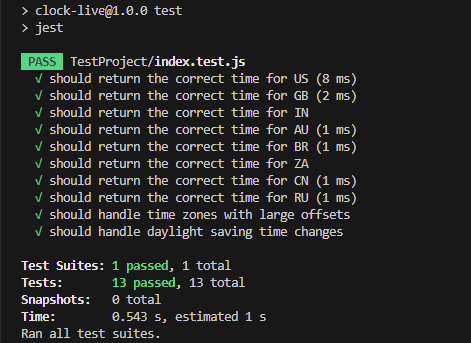

# clock-live
A simple npm package to get the current time for different countries.

## Installation

`npm install clock-live`

## Usage
`
const { getTimeForCountry } = require('world-time');
console.log(getTimeForCountry('US')); // Output: current time in New York
console.log(getTimeForCountry('GB')); // Output: current time in London
`

## Supported Countries
- It is Supported for every country, Do let me know if your country missed.

## Contribution 
- Contributions to the package are welcome! If you would like to add support for additional countries or improve the package. Feel free to fork the repository and explore
